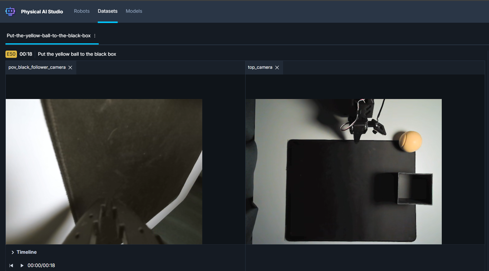
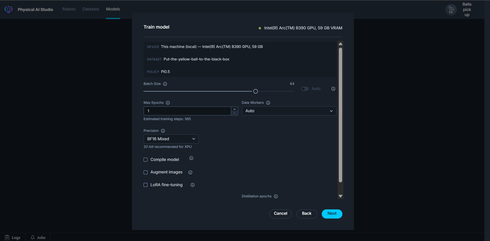
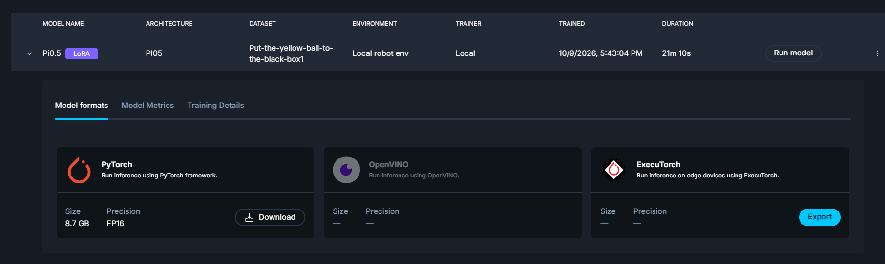
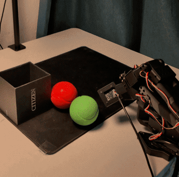

# From robot demonstrations to edge inference with ExecuTorch and OpenVINO

Robot manipulation has moved from hand-written motion planners to learned policies. Vision-language-action models such as Pi0.5 take camera frames, joint states, and a plain-language instruction, and predict a chunk of future actions — you demonstrate the behaviour instead of programming it. The hard part is rarely the model; it is capturing clean synchronized data, training on it, and then getting a multi-billion-parameter transformer to run fast enough on the machine next to the robot. That chain usually spans half a dozen tools, and every handoff is a chance for the input contract to drift.

**Physical AI Studio** keeps it in one application: record, train, export, and run the result back on the robot, with a Python API underneath for anything you want to automate. For deployment it builds on **ExecuTorch**, PyTorch's edge runtime, which packages a trained model into a self-contained `.pte` file with no Python interpreter at inference time. Its **OpenVINO delegate** routes supported subgraphs to Intel CPUs, GPUs, and NPUs, and falls back to portable kernels for the rest.

Here is that path end to end — a pick-and-place demonstration turned into a Pi0.5 policy, exported through ExecuTorch with the OpenVINO delegate, and run on an Intel XPU.

## 1. Capture the task in Studio

Follow the [Studio installation guide](application/docs/01-installation.md), connect a leader and follower arm and cameras, then create an environment and dataset. Teleoperate the pick-and-place task, return the robot home at the end of each episode, and keep only clean demonstrations. Pi0.5 is language-conditioned, so give the dataset a specific task string such as “pick up the brown cube and place it in the black box.” Start with around 50 consistent episodes; the [recording guide](application/docs/05-recording-datasets.md) shows how to review camera footage and joint traces before training.



## 2. Train a policy

In **Models → Train model**, select that dataset and **Pi0.5**, then follow the loss curve and logs. Pi0.5 pulls its backbone from Hugging Face Hub, so configure a read-scoped token in **Settings → General → Hugging Face** first. Save the checkpoint and training settings, and test the policy on held-out trials before exporting.



## 3. Export with the OpenVINO delegate

In Studio, open the trained model and look at its **Model formats** card: each backend — PyTorch, OpenVINO, ONNX, **ExecuTorch** — gets its own tile with an **Export** button. The ExecuTorch tile adds a **delegate** picker: choose **portable**, **XNNPACK**, or **OpenVINO**, select the target device, and Studio builds the delegated `.pte` for you in one click.



The same export is a single call through the Python API:

```python
from physicalai.policies import Pi05

policy = Pi05.load_from_checkpoint("/path/to/last.ckpt")
policy.eval()
policy.export(
    "./pi05-executorch-openvino",
    backend="executorch",
    delegate="openvino",
    delegate_config={"device": "GPU"},
)
```

This produces `pi05.pte` and `manifest.json`, which carries the policy's input/output contract — including the language input Pi0.5 expects at inference. `device="GPU"` targets the Intel XPU.

## 4. Run the exported policy on the robot

Back in Studio, hit **Run model** on the ExecuTorch format: choose the environment, enter the task string, and Studio wires the cameras and the follower arm to the `.pte` policy for you. Our demo runs on an Intel XPU machine, so the OpenVINO delegate executes the model on the integrated GPU while Studio streams observations and action chunks in real time.

The same artifact loads from Python — `InferenceModel` picks the ExecuTorch backend from the `.pte` extension and reads the input/output contract from `manifest.json`:

```python
from physicalai.inference import InferenceModel

policy = InferenceModel("./pi05-executorch-openvino")

obs, info = env.reset()
done = False
while not done:
    obs["task"] = "pick up the brown cube and place it in the black box"
    action = policy.select_action(obs)
    obs, reward, terminated, truncated, info = env.step(action)
    done = terminated or truncated
```



## Conclusion

We started with an empty dataset and an idle arm, and ended with a Pi0.5 policy running through ExecuTorch on an Intel XPU, picking up a cube. Every step — recording, training, exporting, running — happened in Physical AI Studio, and the only code we wrote was two short snippets that mirror what the UI already does.

If you want to try it, start with the [installation guide](application/docs/01-installation.md) and the [recording guide](application/docs/05-recording-datasets.md), then record your own task. A few dozen good demonstrations are enough to see the whole loop work end to end.
